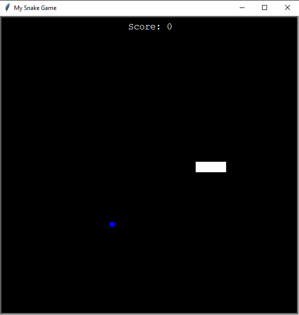

# Snake Game

This is a classic Snake game implemented in Python using the Turtle graphics library. The game involves controlling a snake to eat food and grow longer, while avoiding collisions with walls and itself.

## Getting Started

### Prerequisites

- Python 3 installed on your system
- Turtle graphics library (usually included in Python standard library)

### Installing

1. Clone the repository to your local machine:
   ```sh
   git clone https://github.com/your_username/snake-game.git

2. Navigate to the project directory: 
    ```sh
   cd snake-game
   
3. Run the game: 
    ```sh
   python main.py

### How to Play
- Use the W, S, A, and D keys to control the snake's movement.
  - W: Move the snake up
  - S: Move the snake down
  - A: Move the snake left
  - D: Move the snake right

- The snake will move continuously in the direction it's facing.

- Eat the food (green dot) to grow longer.

- Avoid running into walls or the snake's own body.

### Features

- Snake Movement: The snake moves continuously in the direction it's facing.
- Food: Blue dots represent food. When the snake eats food, it grows longer.
- Score: Keep track of your score as you eat food.
- Game Over: The game ends when the snake collides with walls or itself.
- Restart: Close the game window and rerun the program to play again.

### Controls

- W: Move snake up
- S: Move snake down
- A: Move snake left
- D: Move snake right

### Screenshots

<p align="center">
  
</p>

### Acknowledgments
    
- This game is inspired by the classic Snake game.
- Turtle graphics library for Python makes it easy to create simple games and graphics.